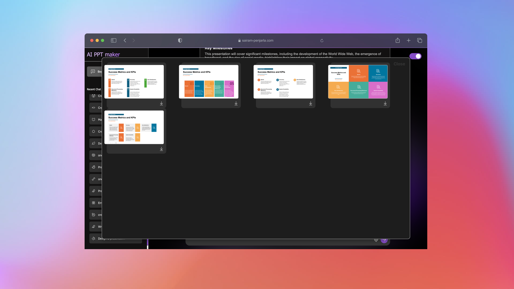

# [](https://psairam9301.wixsite.com/website) [](https://www.youtube.com/@sairampenjarla) [](https://github.com/sairam-penjarla) [](https://www.linkedin.com/in/sairam-penjarla-b5041b121/) [](https://www.instagram.com/sairam.ipynb/)

# GenAI PowerPoint Maker

An AI-powered agent designed to create PowerPoint presentations efficiently based on user-provided prompts.

---

## 🚀 Getting Started

### Clone the Repository

```bash
git clone https://github.com/sairam-penjarla/genai-ppt-maker-flask.git
cd genai-ppt-maker-flask
```

### Set Up the Environment

Follow this guide to create a virtual or Anaconda environment: [Link to Blog Post](https://sairampenjarla.notion.site/Environment-171d56a2fc2780dd9efcd4cef331fa2c).

#### Virtual Environment Setup

```bash
# Create a virtual environment
python -m venv env

# Activate the environment
# Windows:
env\Scripts\activate
# MacOS/Linux:
source env/bin/activate
```

#### Install Dependencies

```bash
pip install -r requirements.txt
```

#### Add API Key

- Create a `.env` file in the root directory.
- Add your OpenAI API key:

```env
OPENAI_API_KEY=your_openai_api_key
```

### Run the Application

```bash
python app.py
```

Navigate to `http://127.0.0.1:5000` in your browser.

---

## 📚 About the Project

### Purpose

The **GenAI PowerPoint Maker** helps users generate PowerPoint slides effortlessly using simple prompts. The goal is to save time and streamline the process of creating professional presentations.

### Features

- **AI-Powered Slide Creation**: Enter a prompt to generate slides automatically.
- **Pre-designed Templates**: Choose from five pre-made templates to download slides.
- **Session Management**: Save, view, and delete previous sessions from the sidebar.
- **Dark/Light Mode Toggle**: Aesthetic toggle between light and dark themes.
- **Loading Animations**: Displays a circular loading animation during processing.
- **Streamed Responses**: Real-time word-by-word generation for better user experience.
- **Input Validation**: Detects and responds appropriately to irrelevant or inappropriate prompts using advanced prompt engineering.
- **Download Functionality**: Download individual slides in `.pptx` format.
- **Responsive Design**: Optimized for a seamless user experience.
- **Logging and Structured Code**: Includes detailed logs, comments, and a clear project structure.

### Key Components

- **Backend**: Flask, OpenAI API, `python-pptx` for PowerPoint file handling.
- **Frontend**: HTML, CSS, JavaScript (Lucide icons for aesthetics).
- **Environment Configuration**: `dotenv` for managing API keys.
- **Architecture Diagram**: Detailed overview available in the `media` folder.

---

## 🖼️ Screenshots

1. **Loading Animation**  
     
   Shows a circular loading animation after submitting a prompt.

2. **Generated Slides**  
     
   Example of AI-generated slides.

3. **Dark Mode Loading Animation**  
     

4. **Pre-made Templates**  
     

5. **Slides in Dark Mode**  
     

6. **Session Management**  
     

---

## 📂 Architecture Diagram


### Description

- **User Interaction**: Users send prompts through the UI.
- **API Calls**: Requests are routed through Flask APIs (`/generate_slides`, `/download_slide`, etc.).
- **OpenAI Integration**: Generates slide content using advanced prompt engineering and multi-shot learning.
- **Download Slide Workflow**: Fetches pre-designed templates, applies user-selected designs, and returns `.pptx` files.
- **Session Management**: Stores sessions in a structured format with icons for easy identification.

---

## 📖 Learn More

For a detailed walkthrough of the project, visit the blog post:  
[GenAI PowerPoint Maker - Blog Article](https://sairampenjarla.notion.site/Gen-AI-PPT-Maker-187d56a2fc2780da9d7ce24357e377a0)

---

## 🌟 Contributions

Feel free to fork this repository and submit pull requests for improvements. Suggestions and feedback are always welcome!