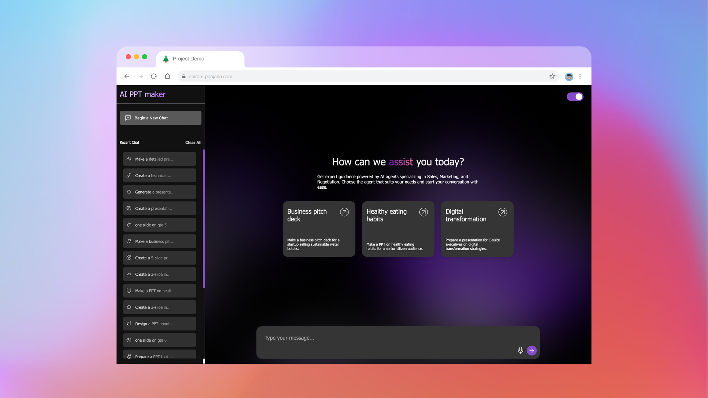

# [](https://psairam9301.wixsite.com/website) [](https://www.youtube.com/@sairampenjarla) [](https://github.com/sairam-penjarla) [](https://www.linkedin.com/in/sairam-penjarla-b5041b121/) [](https://www.instagram.com/sairam.ipynb/)

# AI-Powered Presentation Generator

An AI-powered presentation generator that helps users create PowerPoint slides efficiently using OpenAI. With a simple text prompt, it generates multiple slides per input, allowing users to download individual slides with pre-designed templates.

## 🚀 Getting Started

### Clone the Repository
```bash
git clone https://github.com/sairam-penjarla/genai-ppt-maker-flask.git
cd genai-ppt-maker-flask
```

### Set Up Environment
Refer to this [blog post](https://sairampenjarla.notion.site/Environment-171d56a2fc2780dd9efcd4cef331fa2c) to create a virtual environment.

#### Using `venv` (Virtual Environment)
```bash
python -m venv venv
source venv/bin/activate  # macOS/Linux
venv\Scripts\activate    # Windows
```

#### Using Anaconda
```bash
conda create --name ppt-genai python=3.8
conda activate ppt-genai
```

### Install Dependencies
```bash
pip install -r requirements.txt
```

### Set Up API Key
Create a `.env` file in the project root and add your OpenAI API key:
```env
OPENAI_API_KEY=your_api_key_here
```

### Run the Application
```bash
python run.py
```

The application will start running at `http://127.0.0.1:8000/`

---

## 📌 Features
- **AI-powered slide generation**: Generates PowerPoint slides from a simple text prompt.
- **Pre-designed templates**: Choose from five templates for slide downloads.
- **Session Management**: Keeps track of all previous interactions in the sidebar.
- **Dark/Light Mode Toggle**: Seamlessly switch between dark and light themes.
- **Live Word-by-Word AI Responses**: Uses OpenAI streaming for a natural typing effect.
- **Slide Download Options**: Download individual slides with a chosen template.
- **Error Handling & Prompt Engineering**: Handles irrelevant/inappropriate queries gracefully.
- **Logging & Structured Repo**: Includes `config.yaml`, `requirements.txt`, `README.md`, and `media/` folder with architecture diagrams and UI screenshots.

---


## 🖼️ Screenshots
| Screenshot | Description |
|------------|------------|
|  | Home Screen (Light Mode) |
|  | Home Screen (Dark Mode) |
|  | Sidebar Session Management |
|  | AI-generated slides (Light Mode) |
|  | AI-generated slides (Dark Mode) |
|  | Slide download options |

---

## 🏗️ Architecture


The AI agent follows this flow:
1. **User Input**: The user enters a prompt.
2. **API Request**: JavaScript sends the request to `/generate_slides`.
3. **AI Processing**: The OpenAI API generates slide content.
4. **Slide Display**: The generated slides appear in the UI.
5. **Download Slide**: If a template is chosen, Flask handles the request via `/download_slide`.

Additional API routes:
- `/` - Home
- `/get_session_data` - Retrieve stored sessions
- `/generate_slides` - Generate slides from input
- `/delete_session` - Delete a specific session
- `/delete_all_sessions` - Clear all sessions
- `/download_slide` - Download a slide with a template
- `/update_session` - Update existing session data

---

## 📖 Learn More
For a detailed breakdown, read the [blog article](https://sairampenjarla.notion.site/Meeting-Notes-Generator-18bd56a2fc2780b88319d34a2436342c?pvs=4).

---

## 📬 Contact
For questions or contributions, reach out via [LinkedIn](https://www.linkedin.com/in/sairam-penjarla-b5041b121/) or [GitHub](https://github.com/sairam-penjarla).
